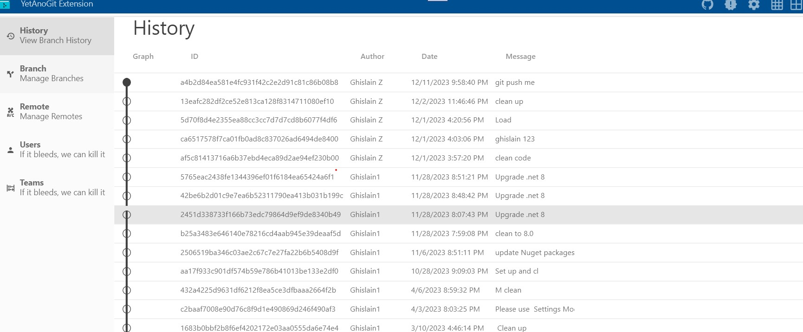

# What's is this?
**Yet Another Git Extension Tool** (YetAnoGit Extension) is a user friendly interface to manange git project. It is a WPF Application based on .NET 8 and written in C# language.

# Main features
- Manage branches
- Manage git revisions
- Display Contributors

# Development
- IDE Visual Studio 2022
- Language C# 12.0
- SDK .NET 8.0 
## Contribution
- PR are welcome
- Issues/Suggestion are welcome
# License
The Tool is licensed under **MIT** license.

# Inspiration
- Design UI ==> [docker desktop](https://github.com/CSharpDesignPro/WPF---MVVM-Based-Modern-Dashboard)
- Styling ===> [MaterilaDesignInXmal](https://github.com/MaterialDesignInXAML/MaterialDesignInXamlToolkit/tree/master)